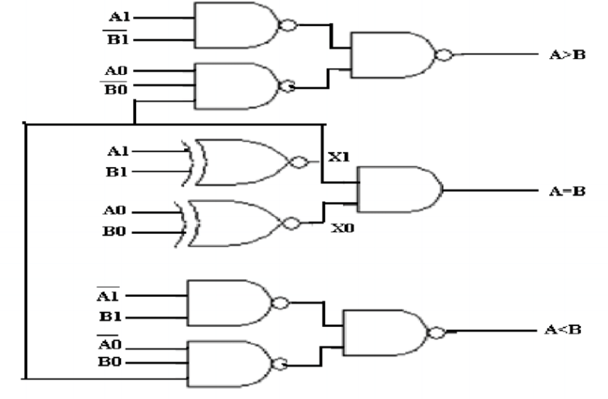
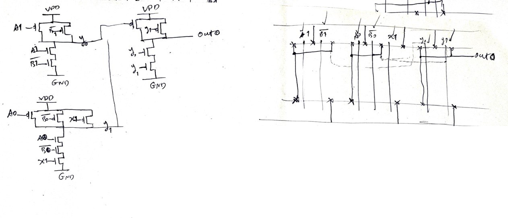
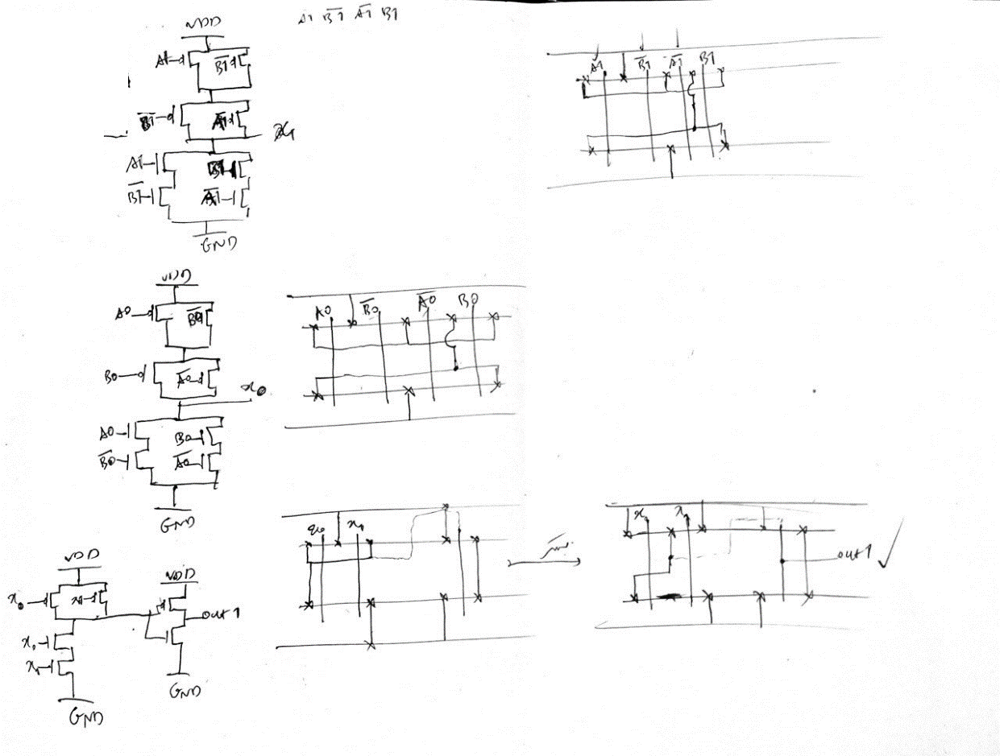
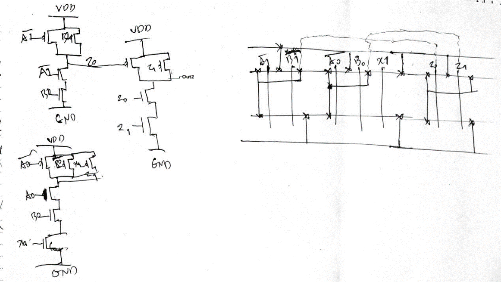
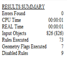
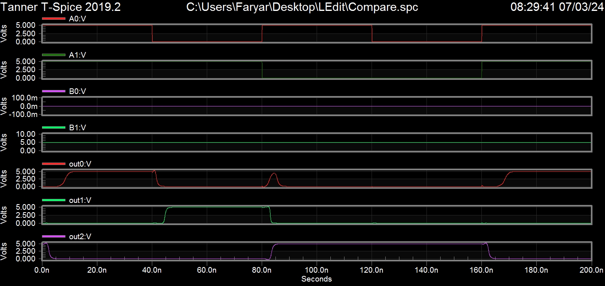
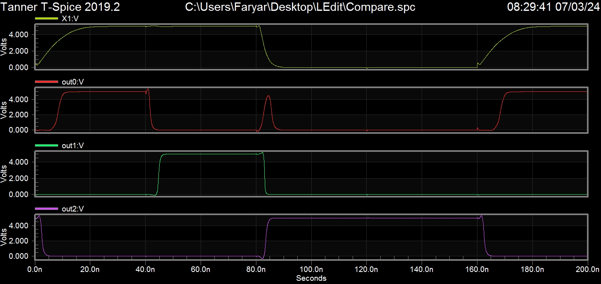

# Compare-logic-CMOS-AVLSI-Layout-LEdit

## Introduction

In this project, a gate-driven circuit is provided for comparing two 2-bit numbers. The inputs are represented as `A1` and `A0`, where `A1` is the most significant bit and `A0` is the least significant bit of number `A`, and similarly, `B1` and `B0` represent the most and least significant bits of number `B`.

The outputs are defined as follows:

- `Out0` indicates the result of the comparison `A > B`
- `Out1` indicates the result of the comparison `A = B`
- `Out2` indicates the result of the comparison `A < B`

Additionally, intermediate nodes labeled `X0`, `X1`, `Y0`, `Y1`, `Z0`, and `Z1` are marked in the schematic.

This report covers:

- The design and construction of the circuit using transistors
- The development of the **stick diagram**
- The final layout of the circuit in **Ledit** software
- The **netlist analysis** of the generated output using simulated waveforms in **Tspice** software

## Compare Circuit Gate Logic

## Transistor Circuit Design and Stick Diagram

For this task, the circuit is divided into three different sections, each responsible for generating one of the outputs: `Out0`, `Out1`, and `Out2`.

At this stage, the designed circuit diagrams are as follows. In the next section, they are integrated into a single cell where their corresponding ports are interconnected.

### Out0 Stick Diagram

### Out1 Stick Diagram

### Out2 Stick Diagram

## Layout Design Based on Stick Diagram and DRC Summary

The circuit layout is designed based on extracted **stick diagrams**, adhering to **technology rules**. The input ports enter the **inverter circuits** from the leftmost section and then propagate to different parts of the circuit.

To interconnect the designed **gates with transistors**, **Metal 2** is primarily used. Additionally, in certain areas where reducing the number of **Vias** and minimizing cell width was possible, alternative connections such as **Metal 1** and **Poly** were utilized.

### DRC Summary:

The summarized **Design Rule Check (DRC) results** are as follows:

## Netlist Output

After extracting the circuit, a **Netlist file** was generated, which includes the necessary code for waveform generation for both **input ports** and **output ports** targeted for display.

The final **simulation-ready code** for execution in **Tspice** can be found in the **Tspice netlist.spc**.

## Simulation Results

To verify the accuracy of the circuit, based on the previously written code:

- The **fixed input value of 2** was assigned to `B` (binary `10`).
- The value of `A` was changed **sequentially** in different pulses.

The resulting **waveforms** are as follows:

- When `A` had values **less than 2** (`01` and `00` in binary), the output `Out0` reached **5V** (logical high), while the remaining outputs stayed at **0V** (logical low).
- When `A` was **equal to 2** (binary `10`), `Out1` was **logical high**, while the others remained **logical low**.
- When `A` was **greater than 2** (`11` in binary), `Out2` became **logical high**, with the remaining outputs at **logical low**.

This confirms the correctness of the circuit operation based on the expected comparison logic.

### Simulation Anomalies

An anomaly is observed in the outputs, where a **short delay** occurs at certain moments during logic transitions. One of the reasons for this delay is the circuit’s dependency on the **X1 value**, which is derived from the output of an **XNOR gate**. The **charging and discharging delays** of the circuit contribute to this timing issue.

For example, the behavior of **X1 output** alongside other outputs is illustrated in the image below:

